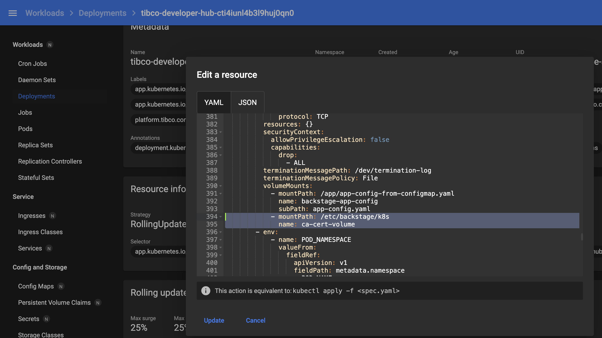
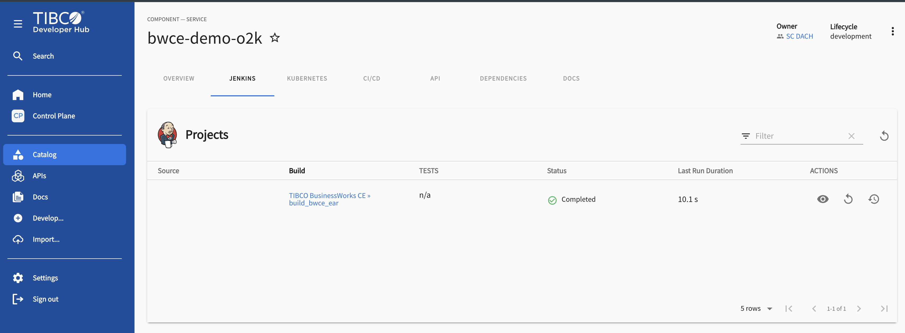
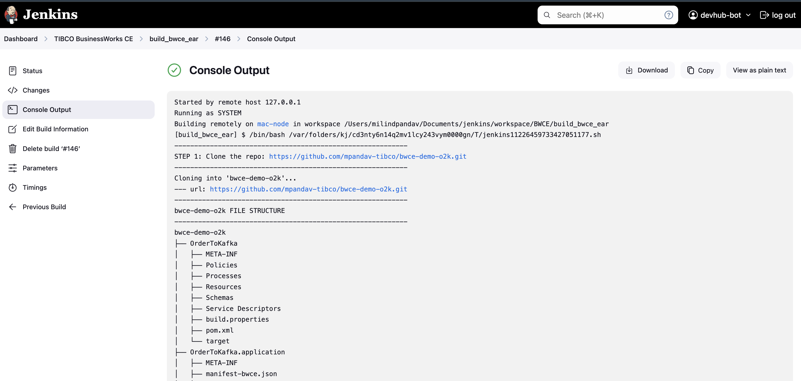
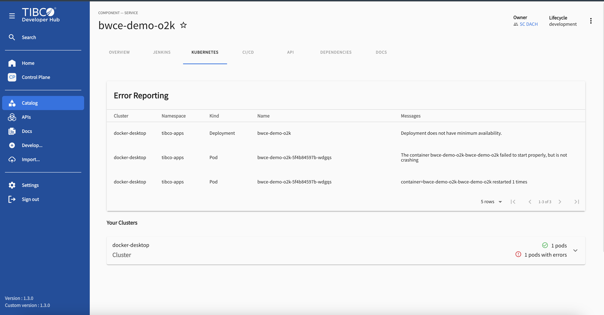
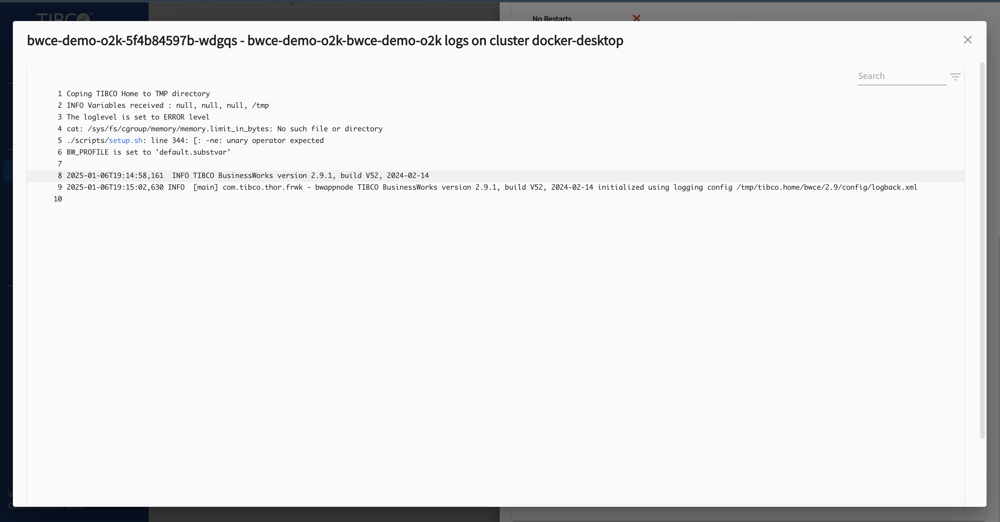
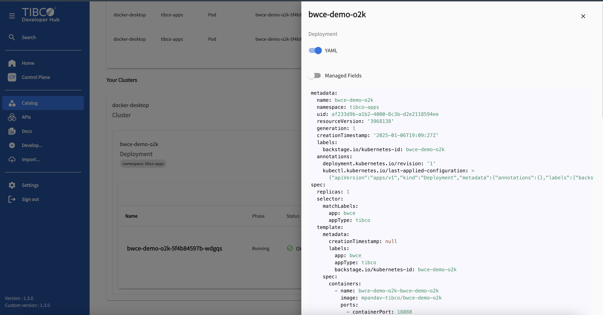

# BWCE in Minutes: Using Dev Hub Templates 

The Developer Hub template simplifies the creation of new TIBCO BusinessWorks Container Edition (BWCE) projects. It automates the process of generating a basic project structure, publishing it to GitHub, registering it in the Dev Hub catalog, and optionally deploying it to Kubernetes or TIBCO Platform.

## Features

* **Project Initialization:** Generates a new BWCE project with a predefined structure, reducing manual setup.
* **GitHub Integration:** Seamlessly publishes the generated project to a GitHub repository for version control and collaboration.
*   **Developer Hub Catalog Registration:** Automatically registers the project as a component in your Developer Hub catalog for centralized project management and discovery.
*   **Jenkins Pipeline Trigger:**  Triggers a Jenkins pipeline to build and deploy the application, enabling continuous integration and continuous delivery (CI/CD).
*   **Flexible Deployment Options:** Offers the choice to deploy the application to either a Kubernetes cluster or a TIBCO Platform environment.


## Prerequisites

* **TIBCO Platform Data Plane (Developer Hub):** A TIBCO Data Plane environment hosting Developer Hub.
* **Custom Dev Hub Image:** A custom Docker image for your Developer Hub that includes the Jenkins and Kubernetes plugins you can prepare one or (choose to use one available: [docker.io/mpandav/devhub-custom-130:latest](https://hub.docker.com/repository/docker/mpandav/devhub-custom-130/general)).
* **Jenkins:** A Jenkins server configured with the required plugins and settings to build and deploy BWCE applications.
    *   Utilize the [quick setup script](https://github.com/mpandav-tibco/external-tools-installation/tree/main/jenkins) to streamline Jenkins server deployment.
    *   Refer to the [Jenkins Build Script README](jenkins-readme.md) for detailed Jenkins configuration instructions.
*   **Kubernetes Cluster (Optional):** A Kubernetes cluster if you choose to deploy the application to a Kubernetes environment.
*   **Sonarqube with BW6 plugin (Optional):**  Utilize the [quick setup script](https://github.com/mpandav-tibco/external-tools-installation/tree/main/sonarqube) to streamline sonarqube server deployment.
*   **Trivy (Optional):** [Security Scanner](https://trivy.dev/latest/)

## Usecase Scenario


## Usage

1.  **Template Installation:** Add [this template](https://github.com/mpandav-tibco/dev-hub-templates/blob/mastart/templates/bwce/Order-To-Kafka/template-otk.yaml) or any available to your Dev Hub instance.
2.  **Create a new component:** In the Dev Hub catalog, click "Create Component" and select this template.
3.  **Fill in the parameters:** Provide the required information in the template form, including:
    *   Project name and description.
    *   Target system (if applicable).
    *   Owner of the component.
    *   Repository location (GitHub URL).
    *   Governance:
       * Code Scan (Sonarqube)
       * Security Scan (Trivy)
    *   Deployment options (if you want to deploy the application):
        *   Deployment target (Kubernetes or TIBCO Platform).
        *   Deployment-specific details (namespace, tokens, etc.).
4.  **Template Execution:** Click "Create" to generate the project and trigger the Jenkins pipeline.

## Jenkins Integration

This template leverages Jenkins to automate the build and deployment process. It triggers a Jenkins pipeline that performs the following actions:

*   Clones the Git repository specified in the template parameters.
*   Builds the BWCE application EAR file using Maven.
*   Creates a Docker image containing the application for containerization.
*   Optionally performs governace steps of sonarqube code scan and trivy image security scan 
*   Optionally deploys the application to the chosen target environment (Kubernetes or TIBCO Platform).
*   Pushes the updated code, Dockerfile, and build artifacts back to the Git repository for version control.

For comprehensive information on setting up and configuring the Jenkins pipeline, refer to the [Jenkins Build Script README](jenkins-readme.md).

## Kubernetes Deployment

When opting for Kubernetes deployment, the template generates or updates a Kubernetes Deployment YAML file. This file defines the deployment configuration, including:

*   Deployment name
*   Container name
*   Docker image
*   Resource limits (CPU and memory)
*   Health checks (liveness, readiness, startup)
*   Labels (including `backstage.io/kubernetes-id` for Dev Hub integration)

The Backstage [Kubernetes plugin](https://backstage.io/docs/features/kubernetes/) enables visualization and management of these deployed Kubernetes resources within your Dev Hub catalog.


## Dev Hub Catalog Integration

The template automatically registers the newly created BWCE project as a component in your Dev Hub catalog. This integration provides:

*   Centralized view of component details, including ownership, repository, and description.
*   Tracking of component lifecycle and dependencies for improved project management.
*   Easy access to related tools and documentation associated with the component.

## Developer Hub Configuration

To utilize this template effectively, configure your Developer Hub (`app-config.yaml`) with the necessary settings:

*   **Authentication:** Configure authentication providers (e.g., GitHub, OAuth2 proxy) to secure your Dev Hub.
*   **Integrations:** Integrate with GitHub and provide necessary credentials (e.g., API tokens).
*   **Catalog Rules:** Define rules to manage the visibility and access control of different entity types in your catalog.
*   **Proxy Endpoints:** Configure proxy endpoints to route requests to external services like Jenkins.
*   **Jenkins Settings:** Provide Jenkins server details, credentials, and API tokens for seamless integration.
*   **Kubernetes Settings:** Configure Kubernetes cluster connection details, including authentication and certificate information.

Refer to the Dev Hub documentation and the provided code snippets and images for detailed configuration instructions.

**Example `app-config.yaml` Configuration**

    // config starts here from auth you keep you baseUrl patha as-is
    
    auth:
    providers:
        github:
        development:
            clientId: ${GIT_CLIENT_ID}
            clientSecret: ${GIT_CLIENT_SECRET}
        oauth2Proxy:
        development: {}
    enableAuthProviders:
        - oauth2Proxy
        - github
    integrations:
    github:
        - host: github.com
        token: ${GITHUB_TOKEN}
    catalog:
    rules:
        - allow:
            - Component
            - API
            - Location
            - Template
            - User
            - Group
            - Domain
            - System
            - Resource
    proxy.endpoints:
    /jenkins/api:
        target: ${JENKINS_URL}
        changeOrigin: true
        headers:
        Authorization: Basic ${JENKINS_AUTH_HEADER}
    jenkins:
    baseUrl: ${JENKINS_URL}
    username: ${JENKINS_USERNAME}
    apiKey: ${JENKINS_AUTH_HEADER}
    jenkinsActionSecretEncryptionKey: ZGVtbzEyMw==
    jenkinsActionJobAuthToken: ${JENKINS_ACTION_AUTH_TOKEN}
    kubernetes:
    serviceLocatorMethod:
        type: multiTenant
    clusterLocatorMethods:
        - type: config
        clusters:
            - url: ${K8S_CLUSTER_URL}
            name: ${K8S_CLUSTER_NAME}
            authProvider: ${K8S_CLUSTER_AUTH_PROVIDER}
            skipTLSVerify: ${K8S_CLUSTER_SKIP_TLS_VERIFY}
            skipMetricsLookup: ${K8S_CLUSTER_SKIP_METRCS_LOOKUP}
            serviceAccountToken: ${K8S_CLUSTER_SERVICE_ACCOUNT_TOKEN}
            caData: ${K8S_CLUSTER_CONFIG_CA_DATA}
            caFile: ${K8S_CLUSTER_CONFIG_CA_FILE}

### Kubernetes configmap
To enable seamless integration with your Kubernetes cluster, the Developer Hub requires specific configuration within its `app-config.yaml` file and a corresponding Kubernetes Secret.

    //configmap 
    $ cat tibco-hub-secrets.yaml 
    apiVersion: v1
    kind: Secret
    metadata:
    name: tibco-hub-secrets
    namespace: <<NAMESPACE>>
    type: Opaque
    stringData:
    GITHUB_TOKEN: <<YOUR GITHUB TOKEN>>
    GIT_CLIENT_ID: <<GIT_CLINET_ID>>     // THIS IS FOR GITHUB ACTIONS CICD TAB - CREATE OAUTH APP TO GET ID AND TOKEN
    GIT_CLIENT_SECRET: <<GIT_CLINET_SECRET>>    // THIS IS FOR GITHUB ACTIONS CICD TAB - CREATE OAUTH APP TO GET ID AND TOKEN
    JENKINS_URL: http://jenkins.localhost.dataplanes.pro <<JENKINS_URL>>
    JENKINS_AUTH_HEADER: <<JENKINS_AUTH_TOKEN>>
    JENKINS_ACTION_AUTH_TOKEN: tibco <<ACTION_TOKEN - CAN BE ANYTHING>>
    JENKINS_USERNAME: devhub-bot <<JENKINS_USER>>
    K8S_CLUSTER_URL: https://192.168.49.2:8443 <<K8S_CLUSTER_URL>>
    K8S_CLUSTER_NAME: docker-desktop / <<K8S_CLUSTER_NAME>>
    K8S_CLUSTER_AUTH_PROVIDER: 'serviceAccount'
    K8S_CLUSTER_SKIP_TLS_VERIFY: 'true'
    K8S_CLUSTER_SKIP_METRCS_LOOKUP: 'false'
    K8S_CLUSTER_SERVICE_ACCOUNT_TOKEN: <<SERVICE_ACCOUNT_TOKEN>>

## Service Account for Dev Hub K8S Plugin
Backstage [k8s plugin](https://backstage.io/docs/features/kubernetes/) requires read access to your k8s cluster to collect and get components data and details. You can [devhub-sa.yaml](./devhub-sa.yaml) to create one and using that generate token. 

### Generate Token
Get a long-lived token by creating a secret

    kubectl apply -f - <<EOF
    apiVersion: v1
    kind: Secret
    metadata:
    name: <SECRET_NAME>
    namespace: <NAMESPACE>
    annotations:
        kubernetes.io/service-account.name: <SERVICE_ACCOUNT_NAME>
    type: kubernetes.io/service-account-token
    EOF

Wait for the token controller to populate a token, and retrieving it with:

    kubectl -n <NAMESPACE> get secret <SECRET_NAME> -o go-template='{{.data.token | base64decode}}'

   
#### **NOTE:**
Below config param are required for Developer Hub to successfully able to connect with your k8s API server. You will find these files for `minikube and docker-desktop` under 
`.kube/config` file. 
Once you have the cert available then import them into same secret and refer them as volume into deployment config  of developer-hub. For more details refer [K8S Plugin documentation](https://backstage.io/docs/features/kubernetes/configuration)
```
caData:

caFile: /path/to/local/file
```
You can choose to use above secret to hold caFile data or you can create new Secrete and mount that in deployment yaml as Volume.

Dev Hub (K8s) Secret having caFile:


Update to Developer Hub Deployment in volume and volumemount:





# Example Workflow
The following steps and screenshots illustrate the process of creating and deploying a BWCE application using BWCE - Order to Kafka template:
1.  **Create a New Component:**
      From the Dev Hub Templates, initiate the creation of a new component and select this template.

      
       

2.  **Specify Repository Location:**

    Provide the URL of the desired GitHub repository where the project will be published.

    
   

3. **Configure Governace Options:**

   Choose whenther to perform governance check on new component; Code Scanning though sonarqube with BW6 plugin and Security Scan of generated Image through Trivy.
   

   
5.  **Configure Deployment Options:**

    Choose whether to deploy the application and select the target environment (Kubernetes or TIBCO Platform). If deploying, provide the necessary deployment details.
   
       

6.  **Review and Create:**

    Review the provided information and click "Create" to generate the project and trigger the Jenkins pipeline.
    

       

7.  **Template Execution and Jenkins Integration:**

    The template will execute the defined steps, including fetching the base template, publishing to GitHub, registering the component in the Developer Hub catalog, and triggering the Jenkins pipeline.
   
       

8.  **Monitor Jenkins Pipeline:**

    Navigate to the "Jenkins" tab in the component's Developer Hub page to monitor the progress and results of the Jenkins pipeline.
   
   

9. **Trivy Sec Scanning Report**

   The Docker Image scan report will be available under '/build-artifacts' folder
   

10. **Sonarqube Code Scan Report:**

   You can open the sonarqube dashboards -> project and review the result for your application. 
   

11.  **View Kubernetes Deployment (if applicable):**

If you chose to deploy to Kubernetes, use the "Kubernetes" tab in the component's Developer Hub page to view the deployment details, pod status, logs, and other relevant information
 

 

 

 

 



# Conclusion

This Developer Hub template streamlines the creation and deployment of TIBCO BWCE projects, automating key tasks and promoting consistency. Its integration with Jenkins enables robust CI/CD, while the optional Kubernetes or TIBCO Platform deployment offers flexibility. By leveraging this template, you can accelerate development, enhance collaboration, and ensure reliable deployments within your TIBCO ecosystem
